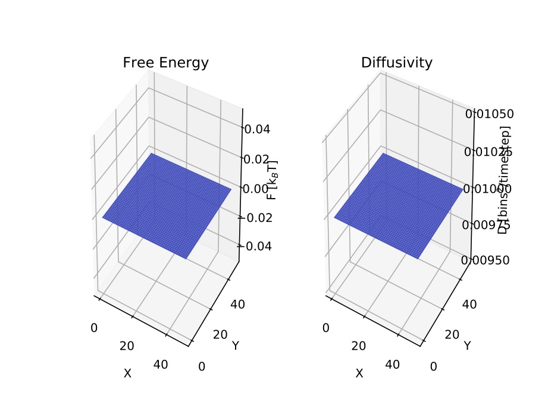
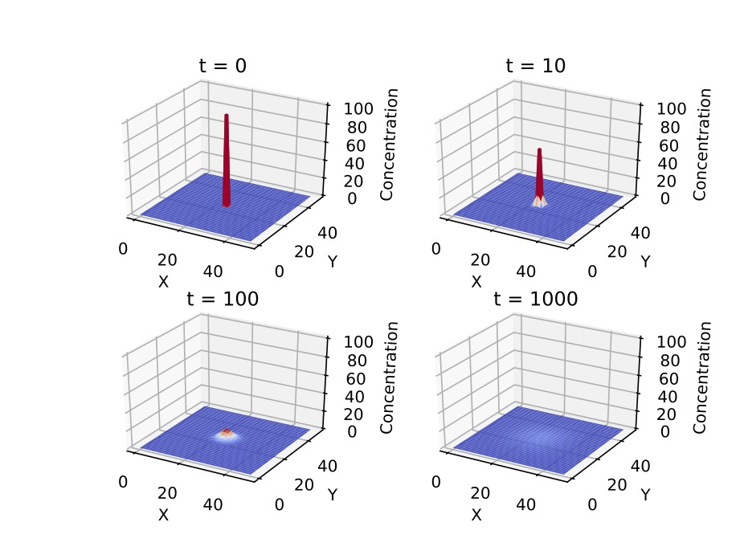
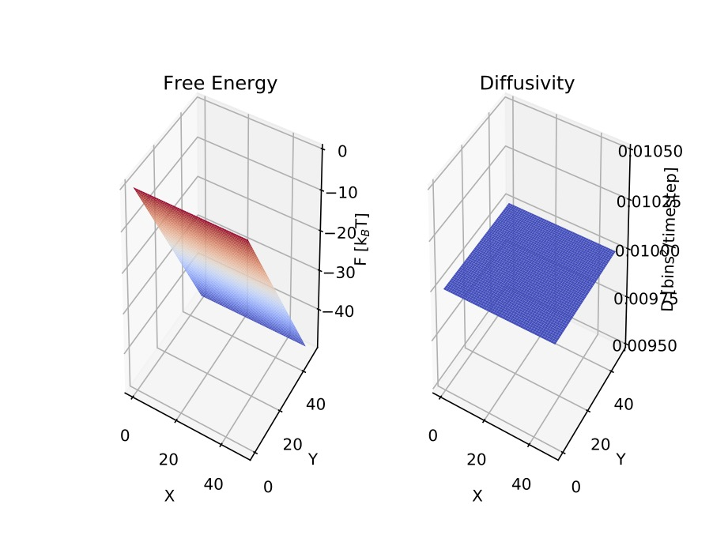
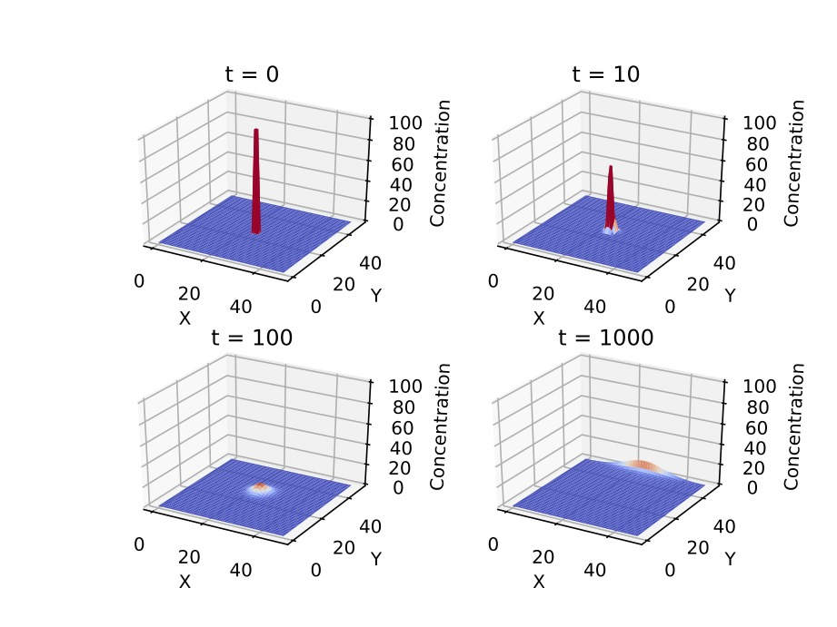

# Numerical Solver for the two dimensional Fokker-Planck Equation (FPE).

The generalized Diffusion Equation in two dimensions reads:

The solver works generally for any diffusivity and free energy landscape.

# Exemplary Results:
Flat Energy Landscape

Inclined Energy Landscape

